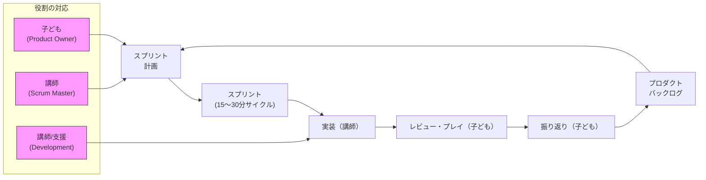

# 自由研究：ゲームづくりプロジェクト

## プロジェクトの目的
本プロジェクトの目的は、子どもたちがゲームづくりを通して「自分で考えて試し、周りと協力してより良くする経験」を得ることです。専門的な手法や難しい用語を教えること自体が目的ではありません。

ワークショップは短い時間で何度も試して振り返る形で進めます。子どもたちはアイデア出し、画面や操作の設計、プレイテスト、改善案の提案などに主体的に取り組みます。実際のプログラミングや細かい技術判断は講師や支援者が担当し、子どもたちの考えが確かに動く形になるよう支えます。

### ゴール
- 自分で問題を見つけ、「直して試す」サイクルを回せるようになる。
- アイデアや遊び方を絵や言葉でわかりやすく伝えられるようになる。
- 役割を分けて協力し、短い時間で動くものを作る経験を積む。

## 取り組みの流れ（スクラムのしくみ）
スクラムという言葉はこの進め方の名前です。スクラムとは、チームで短い作業と振り返りを繰り返し、少しずつ良くしていく方法のことです。子どもたちが主体的に決めて試し、トライ＆エラーを繰り返すことで学びを深めることを大切にします。

※詳しいスクラムの解説は本ファイル下部の付録にあります（[付録: スクラムについて（専門的な説明と今回の対応）](#付録-スクラムについて専門的な説明と今回の対応)）。

進め方（各サイクルの簡単な流れ）
1. 計画を立てる：子どもたちで「まず何をやってみるか」を決めます（講師が記録します）。
2. 作る内容を決める：どんな画面にするか、どんな操作で遊ぶかを絵や言葉で決めます（子どもたちが主導します）。
3. 内容を確認する：みんなで相談して、遊んだときに困りそうな点を話し合います。技術的に難しい点は講師が補助します。
4. 動かして確かめる：講師が子どもの案をもとに実装してブラウザで動かします。子どもたちは実際に遊んで挙動や面白さをチェックします。
5. 振り返りと記録：遊んで出た感想や改善案を子どもたちが出し、次に試すことを決めて記録します。

このサイクルを短く回すことで、小さな成功と学びを積み重ねます。

## 学べる力・ねらい
- **順序を考える力（論理的思考）**：遊びのルールや流れを「どう進むか」の順番で考え、紙や図で表現します。
    - 例：ステージの進み方や得点ルールを図にして説明する。
- **問題を見つけて直す力（問題発見・解決）**：遊んでいて違和感があれば原因を考え、改善案を出します。
    - 例：「敵が強すぎる」を観察して「敵の移動を遅くする」という提案をする。
- **伝える力・表現力（デザイン）**：キャラクターや背景の見せ方で伝えたい世界観を作ります。
    - 例：キャラクターの色やBGMのイメージを言葉や絵で伝える。
- **観察とフィードバックの力**：他の子の遊び方を見て、どこが面白いか・改善できるかを具体的に伝えます。
    - 例：プレイを見て「ここで難しい」と気づき、改善案をノートに書く。
- **協力して作る力（コミュニケーション）**：役割を分け、意見を出し合ってチームで作り上げる経験をします。
    - 例：司会役・デザイナー役・テスター役に分かれて実行する。
- **小さな成功体験と自己肯定感**：短いサイクルで動くものを何度も試すことで達成感を育てます。
    - 例：アイデアを出してすぐ遊べる形になることで「できた！」を感じる。
- **デジタルのしくみを知る基礎（技術理解）**：コードを書くことはしませんが、ブラウザで作品が動く仕組みや表現の制約を学びます。
    - 例：『画像はこう置かれると見栄えが良い』など、見た目のルールを体験的に理解する。

これらはすべて「子ども自身が考え、試し、他者に伝える」ことを通じて身につく力です。講師は技術面の実装を担当し、子どもたちの考えが形になるよう支援します。

## 成果の見せ方・公開方法
作ったゲームは、ブラウザで遊べる形で公開しています。URLを共有したり、発表会でプレイしてもらうことで達成感を高めます。

また、ワークショップで出た「問題点の整理（ISSUE）」や、講師が実装した内容に対する「仕様とレビュー（PR）」も公開・管理しています。これらのISSUEやPRを閲覧することで、どのような議論が行われ、どのように改善が進んだかを追跡できます。

- 公開される内容の例：ワークショップ中に洗い出した課題（Issue）、その課題に対して行った行動（PR）、PRに対するレビューコメント
    - `Issues`タブと`Pull requests`タブで該当するスレッドを確認してください（例: https://github.com/scrumrecreation/ScrumRecreation-template/issues、https://github.com/scrumrecreation/ScrumRecreation-template/pulls）。
- 作成したゲーム（例）
    - ブロック崩しゲーム: https://scrumrecreation.github.io/ScrumRecreation-template/BrickBreaker/
--- 

## Projects Overview

各サンプルは、ワークショップでの「自由に作って試す楽しさ」と「見た目の派手さ（プレゼン性）」を両立するために設計されています。コードの細部というより、どこまで自由に改変して良いかを判断し、短いスプリントで改善を回す体験を重視します。

- **BrickBreaker/** — 最小限のブロック崩しの骨組み
    - 役割: 実装が最小に抑えられており、ゲームシステムもわかりやすいため、自由にルールや演出を追加して「どこまで面白くできるか」「自分の理想を形にするか」を試すのに最適です。

各プロジェクトとも「まず小さく動くものを作る」「見た目で魅せる改善を短時間で試す」「結果をプレイテストして次の改善を決める」というサイクルを回すことが狙いです。ワークショップ向けに短いタスク例やプレイテストチェックリストを追加できます。希望があれば作成します。

---

## 付録: スクラムについて（専門的な説明と今回の対応）
スクラムは経験に基づくプロセス制御（透明性・検査・適応）を原則とするフレームワークで、短い時間で動く成果（インクリメント）を繰り返し提供し、実際の利用やフィードバックを通じて価値を高めていきます。
主な特徴は
（1）タイムボックス化された反復
（2）明確な役割と成果物
（3）継続的な振り返りによる適応
これによりリスクを低減し早期に学習を得られます。
以下に主要な専門用語の定義を示し、それぞれ「今回のスクラムではどれに当たるか」を対応付けます。

- 役割（Roles）
    - 定義：プロダクトオーナー（何を優先するか決める）、スクラムマスター（進行支援）、開発チーム（実装担当）。
    - 今回の対応（これはここにあたる）:
        - プロダクトオーナー → 子どもたち（アイデアや優先を決める主体）
        - スクラムマスター → 講師／ファシリテーター（進行支援・障害対応）
        - 開発チーム → 講師と支援者（コード実装と統合を担う）

- イベント（Events）
    - 定義：スプリント（反復期間）、スプリント計画、デイリースクラム、スプリントレビュー、レトロスペクティブ等。
    - 今回の対応（これはここにあたる）:
        - スプリント → 短いサイクル（15〜30分）を複数回回すワークショップ形式
        - スプリント計画 → 子どもが「まず試すこと」を決め、講師が記録・調整
        - デイリースクラム → 簡易な進捗共有（短い口頭確認）または省略してサイクルを回す
        - スプリントレビュー → 子どものプレイとフィードバック（関係者へ披露）
        - レトロスペクティブ → 振り返りで改善案を出し次回へつなぐ（子ども主体の話し合い）

- 成果物（Artifacts）
    - 定義：プロダクトバックログ（やること一覧）、スプリントバックログ（当該スプリントの作業）、インクリメント（完成した配布可能な成果物）。
    - 今回の対応（これはここにあたる）:
        - プロダクトバックログ → 子どものアイデアメモ・改善案一覧（講師が整理）
        - スプリントバックログ → そのサイクルで試す具体的タスク（簡単なチェックリスト）
        - インクリメント → 講師が作成する「遊べるビルド（ブラウザで動く成果物）」

- 利点と留意点
    - 定義（利点）：早期フィードバック、リスク低減、透明性、チームの自己組織化促進。
    - 今回の留意点（これはここにあたる）:
        - 利点の享受：短いサイクルで子どもが即フィードバックを受けられるようにする。
        - 留意点：形式をなぞるだけでなく、子どもの主体性を尊重して講師が技術的に支えることが重要。

        #### スクラムのメリット（一般論）
        - 早期フィードバック：短い反復でユーザーやステークホルダーの反応を早く得られる。
        - リスク低減：問題を小さいうちに発見・対処できるため、大きな手戻りを防げる。
        - 柔軟性：優先順位を変えながら価値の高い項目に集中できる。
        - 透明性：進捗・課題が見える化され、関係者の共通理解が得られる。
        - 品質向上：小さな単位で検証を繰り返すことで品質を高める。
        - チームの自律性向上：メンバーが意思決定に参加し、効率的に動けるようになる。
        - ステークホルダーの関与促進：定期的なレビューで期待値をすり合わせられる。
        - 継続的改善：振り返りを通じてプロセスを継続的に改善できる。

        これらのメリットは規模や文脈により実現方法が異なりますが、本ワークショップでも短いサイクルと明確な役割分担により小規模な形で享受できます。

### 実際の割り当て（簡潔）
- 子ども：アイデア出し・設計・プレイテスト・改善提案（Product Owner 的振る舞い）
- 講師：進行管理・実装・安全管理・技術的判断（Scrum Master + 開発チーム の一部）
- 保護者：見守り・フィードバック提供・公開同意
- ツール/支援（AI含む）：テンプレート生成や実装補助で講師を支援

この対応表により、専門用語で示される役割や成果物がワークショップの具体的な活動にどう対応するかが一目で分かります。

 
### スクラム的解決手法を身につけたときのメリットと日常での応用
- **問題の分解と優先付けができる**：大きな課題を小さく分けて優先順位をつける習慣が身につきます。
    - 日常例：宿題や自由研究の進め方を『まず何を試すか』で分割して進める。
- **短い試行と改善で早く学べる**：小さく試して振り返ることで失敗のコストを下げ、学びを早く回収できます。
    - 日常例：料理や工作で一部分ずつ試しながら仕上げる。
- **意思決定が速くなる・優先度を考える力**：限られた時間で何を優先するかを判断できるようになります。
    - 日常例：遊びの時間と宿題の時間配分を自分で決められる。
- **協働と対話の技術が身につく**：役割分担・フィードバック・合意形成の経験がチームワークを育てます。
    - 日常例：友だちと遊ぶときのルール決めや分担に役立つ。
- **失敗に対する抵抗感が下がる（レジリエンス）**：試して直す文化が失敗を学びに変えます。
    - 日常例：ゲームやスポーツでうまくいかないときに改善案を試す習慣。
- **簡潔な記録と共有が習慣化する**：やったこと、次にやることを短くまとめるスキルが育ちます。
    - 日常例：持ち物リストややることメモを作ることで準備が楽になる。

これらは学校や家庭、クラブ活動などさまざまな場面で応用できます。ワークショップでスクラム的な思考を体験することで、子どもたちが日常的に問題に向き合う際の道具として活用できるようになります。

---

#### チラシ

https://scrumrecreation.github.io/ScrumRecreation-template/Flyers/flyer.html